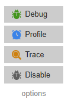

#  Xdebug Extension

A modern, dependency-free, cross-browser extension for Xdebug.

This work is based on some of the ideas in the legacy [Xdebug helper](https://chromewebstore.google.com/detail/xdebug-helper/eadndfjplgieldjbigjakmdgkmoaaaoc) extension.

The motivation for this new extension was that `xdebug-helper` will soon no longer be supported and was limited to Chrome in any case. I had originally intended to update and submit a PR on that extension, but realized that it was probably better to just start from scratch using a more modern approach.

## Features

- Set custom IDE key, trace trigger, and profile triggers
  

- Toggle debugging, profiling, and tracing

## Installation

### Chrome

1) Clone the `xdebug-extension` repository
2) Go to `chrome://extensions/`
3) Turn on "Developer Mode"
4) Choose "Load unpacked extension"
5) select the `src` directory inside the `xdebug-extension` directory you downloaded in step one.

### Firefox

_NB: this requires building to account for differences in the manifest file_

1) Clone the `xdebug-extension` repository
2) Run the `build.sh` file 
3) Click on "This Firefox"
4) Choose "Load Temporary Add-on…"
5) Select the `xdebug-extension@[version].xpi` file in the `xdebug-extension/build` directory.
   
### Edge 

1) Clone the `xdebug-extension` repository
2) Go to `edge://extensions/`
3) Turn on "Developer Mode"
4) Choose "Load unpacked"
5) select the `src` directory inside the `xdebug-extension` directory you downloaded in step one.

   
## Usage

Once installed, you can:

- Toggle the popup with (default: <kbd>Alt</kbd>+<kbd>X</kbd>) or by clicking the extension icon.
- Toggle debugging with a shortcut (default: <kbd>Alt</kbd>+<kbd>C</kbd>) or from the popup menu.
- Toggle profiling with a shortcut (default: <kbd>Alt</kbd>+<kbd>V</kbd>) or from the popup menu.
- Toggle tracing with a shortcut (default: <kbd>Alt</kbd>+<kbd>B</kbd>) or from the popup menu.
- Click the extension icon to open the popup menu and select a debugging state: Debug, Profile, Trace, or Disable.
- Clink the "options" link in the popupto configure the IDE key, profile trigger, and trace trigger. Alternatively, right click the extension icon and choose "Options".

## Contributing

If you want to contribute and make it even better, feel free to fork the repository and submit a pull request. Your contributions are always welcome!

## License

This project is licensed under the MIT License - see the [LICENSE](LICENSE) file for details.
