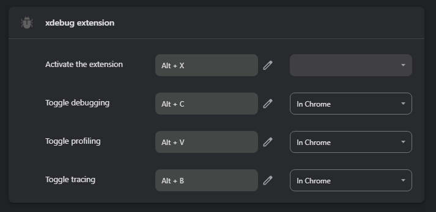
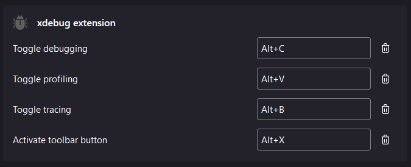
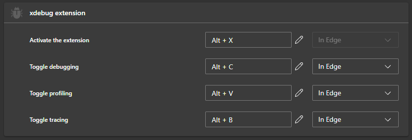

#  Xdebug Extension

A modern, dependency-free, cross-browser extension for Xdebug.

It works in Chrome*, Firefox and Edge browsers

This work is based on some of the ideas in the legacy [Xdebug helper](https://chromewebstore.google.com/detail/xdebug-helper/eadndfjplgieldjbigjakmdgkmoaaaoc) extension.

The motivation for this new extension was that `xdebug-helper` will soon no longer be supported and was limited to Chrome in any case. I had originally intended to update and submit a PR on that extension, but realized that it was probably better to just start from scratch using a more modern approach.

  

_* It may also work on other Chromium based browsers (Opera, Vivaldi, Brave, etc) that allow Chrome extensions, however these are untested and are not offically supported by this project._

> [!NOTE]
> This extension was originally developed by [@FraserChapman](https://github.com/FraserChapman), who continues to maintain it in collaboration with [@JetBrains](https://github.com/JetBrains).
> We appreciate Fraser’s work in making debugging easier for PHP developers!

## Features

- Set custom IDE key, trace trigger, and profile triggers

- Toggle debugging, profiling, and tracing

## Installation

### Chrome

From source

1) Clone the `xdebug-extension` repository
2) Go to `chrome://extensions/`
3) Turn on "Developer Mode"
4) Choose "Load unpacked extension"
5) select the `src` directory inside the `xdebug-extension` directory you downloaded in step one.

### Firefox

From Mozilla Addons

From source

1) Clone the `xdebug-extension` repository
2) Run the the build file: `. build.sh`
3) Navigate to `about:debugging#/runtime/this-firefox`
4) Choose "Load Temporary Add-on…"
5) Select the `xdebug-extension@[version].xpi` file in the `xdebug-extension/build` directory.

Prebuilt

1) Download the latest xpi file from [releases](https://github.com/FraserChapman/xdebug-extension/releases) e.g `xdebug-extension@1.0.0.xpi`
2) Click on "This Firefox"
3) Choose "Load Temporary Add-on…"
4) Select the `xdebug-extension@[version].xpi` file you downloaded in step one.

### Edge

From source

1) Clone the `xdebug-extension` repository
2) Go to `edge://extensions/`
3) Turn on "Developer Mode"
4) Choose "Load unpacked"
5) select the `src` directory inside the `xdebug-extension` directory you downloaded in step one.

## Usage

Once installed, you can:

- Toggle the popup with (default: <kbd>Alt</kbd>+<kbd>X</kbd>) or by clicking the extension icon.
- Toggle debugging with a shortcut (default: <kbd>Alt</kbd>+<kbd>C</kbd>) or from the popup menu.
- Toggle profiling with a shortcut (default: <kbd>Alt</kbd>+<kbd>V</kbd>) or from the popup menu.
- Toggle tracing with a shortcut (default: <kbd>Alt</kbd>+<kbd>B</kbd>) or from the popup menu.
- Click the extension icon to open the popup menu and select a debugging state: Debug, Profile, Trace, or Disable.
- Clink the "options" link in the popup to configure the IDE key, profile trigger, and trace trigger. Alternatively, right click the extension icon and choose "Options".

### Custom shortcuts

#### Chrome

1) shortcuts can be configured via `chrome://extensions/shortcuts`

#### FireFox

1) Click the menu button
2) Click Add-ons and themes
3) Select Extensions.
4) Click the Tools for all add-ons cogwheel.
5) Click `Manage Extension Shortcuts` in the menu.

#### Edge

1) shortcuts can be configured via `edge://extensions/shortcuts`

## Contributing

If you want to contribute and make it even better, feel free to fork the repository and submit a pull request. Your contributions are always welcome!

## License

This project is licensed under the MIT License - see the [LICENSE](LICENSE) file for details.

## Icons

 [Freepik](https://www.flaticon.com/free-icons/bug)

 [rukanicon](https://www.freepik.com/icon/search_4529794#fromView=search&page=2&position=4&uuid=b4d99857-87e6-4c31-8244-0681fc37c27c)

 [UIcons](https://www.freepik.com/icon/alarm-clock_3914623#fromView=search&page=2&position=53&uuid=2ee3fb72-66da-4ded-b901-b35f13d97f02)
